# 安装go语言开发环境实验报告
### 开发环境
Ubuntu18.04.3
### 1.安装 VSCode 编辑器
首先下载安装包：[VSCode下载链接](https://code.visualstudio.com/docs/?dv=linux64_deb)

然后拷贝到虚拟机中，在终端执行命令(x对应下载的版本)

```
sudo dpkg -i code_x.xx.x-xxxxxxxxxx_amd64.deb 
```

安装完成后重启，就可以在Application中找到VSCode了。

### 2.安装 golang
#### 2.1安装
在终端执行命令

``` 
sudo apt-get install golang
``` 

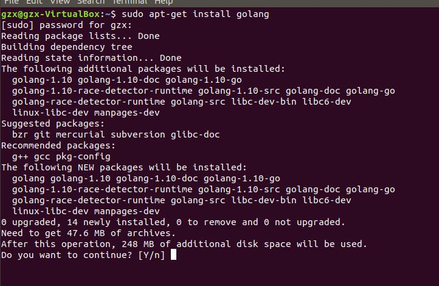

安装好之后在终端输入```go version```来查看go语言的版本

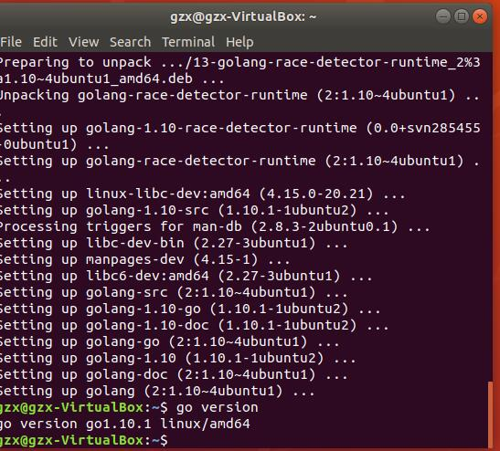

#### 2.2设置环境变量
- **创建工作空间**


    在终端中输入命令```mkdir $HOME/gowork```
- **配置的环境变量**
   
    在终端中输入命令```sudo gedit ~/.bashrc```,在打开的文件中最末尾添加两行代码
    ```
	export GOPATH=$HOME/gowork
	export PATH=$PATH:$GOPATH/bin
    ```
	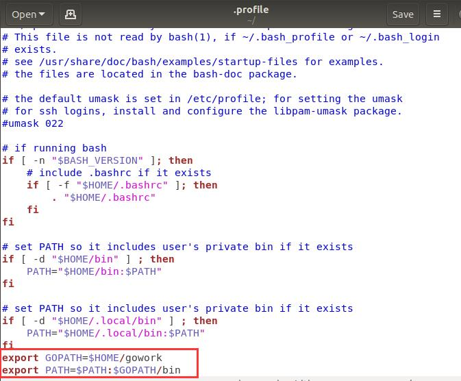
	
	保存后在终端执行命令```source ~/.bashrc```更新配置
- **检查配置**

	终端执行命令```go env```查看go的环境配置
	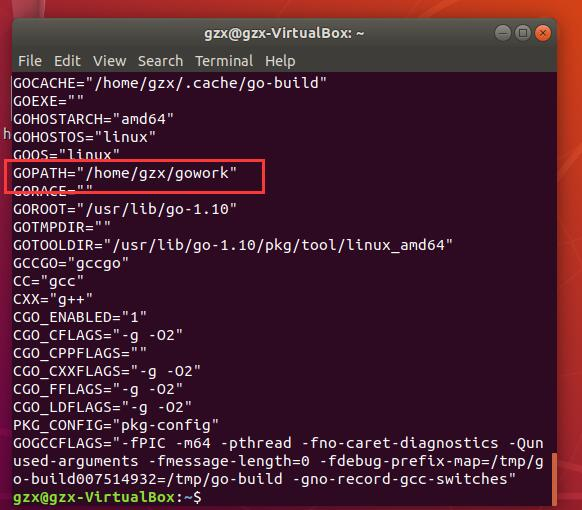
#### 2.3创建 hello world！
首先创建源代码目录：

```
mkdir $GOPATH/src/github.com/user/hello -p
```
然后使用 VSCode 创建 hello.go，并填入以下代码：

```
package main

import "fmt"

func main() {
    fmt.Printf("hello, world\n")
}
```

保存关闭后在终端执行
```
cd $GOPATH/src/github.com/user/hello
go run hello.go
```
或者
```
cd $GOPATH/src/github.com/user/hello
go install
hello
```
就会输出hello,world了。

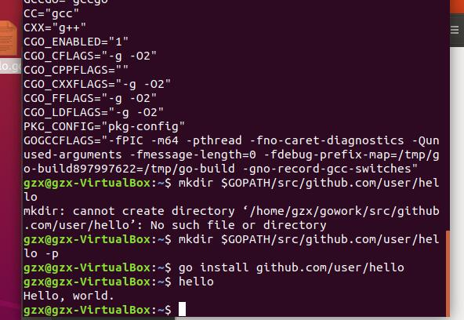

### 3.安装必要的工具和插件
#### 3.1安装git
终端输入命令```sudo apt-get install git```安装即可。

#### 3.2安装VSCode的go插件
打开VSCode，点击左侧第五个图标，在搜索栏输入go，点击第一个插件，点击安装即可。

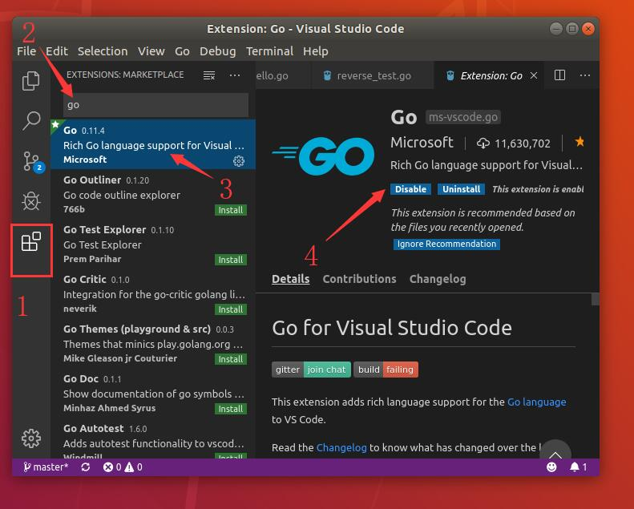

### 4.创建第一个库
首先选择库的路径，在终端输入

```
mkdir $GOPATH/src/github.com/user/stringutil
```

接着在该目录中创建go文件，名字为reverse.go，打开输入以下内容：

```
// stringutil 包含有用于处理字符串的工具函数。
package stringutil

// Reverse 将其实参字符串以符文为单位左右反转。
func Reverse(s string) string {
	r := []rune(s)
	for i, j := 0, len(r)-1; i < len(r)/2; i, j = i+1, j-1 {
		r[i], r[j] = r[j], r[i]
	}
	return string(r)
}
```

然后用go bulid命令来测试该包的编译：

```
go build github.com/user/stringutil
```

或者

```
cd $GOPATH/src/github.com/user/stringutil
go build
```

这里并不会产生任何输出文件。如果想要输出的话，必须使用 go install 命令，它会将包的对象放到工作空间的 pkg 目录中。

确认 stringutil 包构建完毕后，修改原来的 hello.go 文件（它位于 $GOPATH/src/github.com/user/hello）去使用它：

```
package main

import (
	"fmt"

	"github.com/user/stringutil"
)

func main() {
	fmt.Printf(stringutil.Reverse("!oG ,olleH"))
}
```

更改完保存后，在终端输入

```
go install github.com/user/hello
hello
```

就会看到Hello, Go!的输出了。
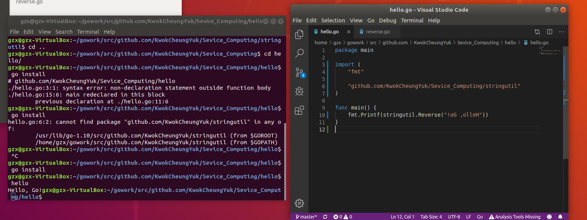

做到这里之后，工作空间应该变成这样子

```
bin/
	hello                 # 可执行命令
pkg/
	linux_amd64/          # 这里会反映出你的操作系统和架构
		github.com/user/
			stringutil.a  # 包对象
src/
	github.com/user/
		hello/
			hello.go      # 命令源码
		stringutil/
			reverse.go       # 包源码
```

以下是我的工作空间截图：

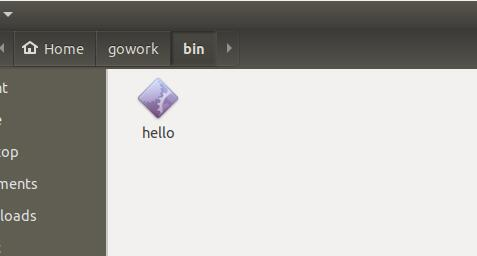
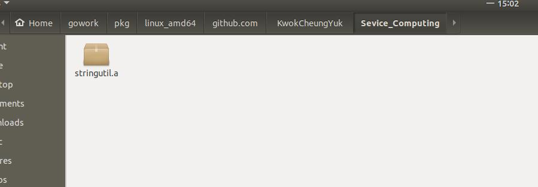
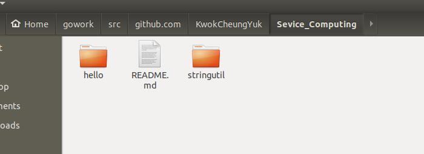

### 5.创建第一个测试
你可以通过创建一个名字以 _test.go 结尾的，包含名为 TestXXX 且签名为 func (t *testing.T) 函数的文件来编写测试。 测试框架会运行每一个这样的函数；若该函数调用了像 t.Error 或 t.Fail 这样表示失败的函数，此测试即表示失败。

我们可通过创建文件 $GOPATH/src/github.com/user/stringutil/reverse_test.go 来为 stringutil 添加测试，其内容如下：

```
package stringutil

import "testing"

func TestReverse(t *testing.T) {
	cases := []struct {
		in, want string
	}{
		{"Hello, world", "dlrow ,olleH"},
		{"Hello, 世界", "界世 ,olleH"},
		{"", ""},
	}
	for _, c := range cases {
		got := Reverse(c.in)
		if got != c.want {
			t.Errorf("Reverse(%q) == %q, want %q", c.in, got, c.want)
		}
	}
}
```

接着使用 go test 运行该测试：

```
go test github.com/user/stringutil
```

或者

```
cd $GOPATH/src/github.com/user/stringutil
go test
```

若通过测试，则会看到OK字样.


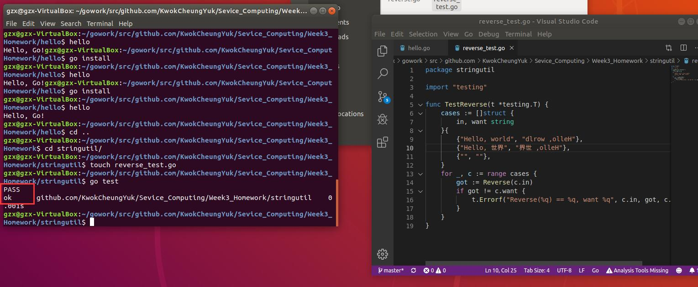

### 6.将文件上传到github上
首先需要在github上创建一个仓库，然后进入仓库，点击clone，或者https链接：

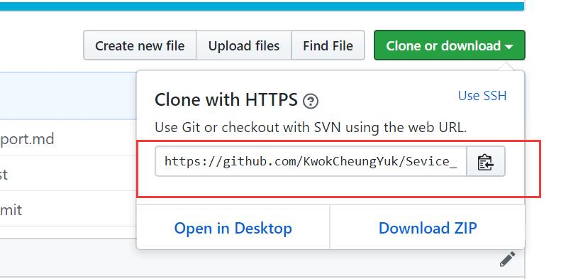

然后在终端中输入

```
git clone https(你想要克隆的仓库链接)
```

就会在终端当前目录下克隆整个仓库下来，若你向文件夹里添加了新的文件，首先可以使用命令```git status ```查看仓库当前的状态，然后可以用命令```git add "文件夹名或者文件名" ```或者```git add . ```来将对应的文件或者全部文件添加到暂存，然后使用命令```git commit -m "修改注释"``` 提交暂存区的文件到本地仓库，最后输入命令```git push```就可以将本地仓库推送到远程仓库中。
